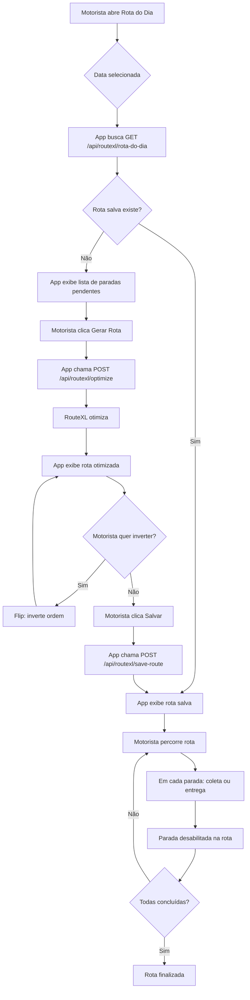

# 3. Telas do Aplicativo

## 3.1 Login

- Campo: Usuário (CPF ou email)
- Campo: Senha
- Botão: Entrar
- **Sem "Esqueci senha"** — admin define a senha
- Após login bem-sucedido: token salvo no SecureStore (Keychain)
- **Próxima abertura:** pula direto para o Dashboard (sem login)

## 3.2 Dashboard (Home)

Cards por perfil — cada card mostra apenas a contagem de itens pendentes.

### Motorista
- 🚚 **Minha Rota de Hoje** → Rota do dia (RouteXL)
- 📦 **Coletas Pendentes** → Lista de coletas do dia
- 📦 **Entregas Pendentes** → Lista de entregas do dia
- ✅ **Finalizados Hoje** → Resumo do dia

### Lavagem (F2)
- 🧼 **Na Fila de Lavagem** → Tapetes aguardando lavagem
- 🧼 **Lavando Agora** → Tapetes em processo
- ✅ **Finalizados Hoje**
- ⚠️ **Sem preços** — valores NUNCA são exibidos

### Secagem (F3)
- ☀️ **Na Fila de Secagem**
- ☀️ **Secando Agora**
- ✅ **Finalizados Hoje**
- ⚠️ **Sem preços** — valores NUNCA são exibidos

### Expedição (F4)
- 📋 **Documentação Pendente** (Etapa 2) → captura de fotos
- 🔄 **Aspiração Pendente** (Etapa 3)
- 📋 **Inspeção Pendente** (Etapa 10)
- 📦 **Embalagem Pendente** (Etapa 11)
- ✅ **Finalizados Hoje**

### Admin
- 📊 **Resumo Geral** — Todos os indicadores
- 💰 **Financeiro** — Valores, pagamentos, PIX (visível apenas para admin)
- 👥 **Todos os perfis** — Pode alternar entre visões

## 3.3 Rota do Dia — Motorista (Fluxo Completo)

### Visão Geral

O motorista gerencia toda a rota do dia dentro do app, replicando as funcionalidades do painel admin (`OtimizarRotaModal` + `ColetasPendentes` + `EntregasPendentes`), mas adaptado para uso mobile com ações de coleta/entrega no campo.

### Funcionalidades

| Funcionalidade | Descrição | Endpoint |
|----------------|-----------|----------|
| **Selecionar data** | Seletor de data para escolher qual dia gerenciar | — |
| **Carregar rota** | Busca rota salva para a data ou permite gerar nova | `GET /api/routexl/rota-do-dia?data=YYYY-MM-DD` |
| **Gerar rota (RouteXL)** | Otimiza a rota com as paradas do dia via RouteXL | `POST /api/routexl/optimize` |
| **Flip (inverter ordem)** | Inverte a ordem das paradas | `POST /api/routexl/optimize` (com skipOptimisation) |
| **Salvar rota** | Persiste a rota otimizada no banco | `POST /api/routexl/save-route` |
| **Ver no mapa** | Abre Google Maps (ou mapa interno) com todas as paradas | Deep link ou `react-native-maps` |
| **Navegar para parada** | Abre Google Maps com rota até o endereço da parada | Deep link `comgooglemaps://?daddr=lat,lng` |
| **Coletar** | Abre câmera + assinatura + confirma coleta | `POST /api/orcamentos/:id/coleta-realizada` |
| **Entregar** | Abre assinatura digital + confirma entrega | `POST /api/orcamentos/:id/entrega-realizada` |

### Tela Principal — Rota do Dia

```
┌──────────────────────────────────────┐
│ 📅 [21/07/2026]  [🔄 Gerar Rota]     │
├──────────────────────────────────────┤
│ Rota • 8 paradas • 42 km • 4h30      │
│ 🟢 4 coletas • 🔵 4 entregas          │
│                                      │
│ ┌── Paradas ───────────────────────┐ │
│ │ 1 🟢 Maria — Coleta              │ │
│ │    Rua X, 123 - 14:30h           │ │
│ │    [✅ Coletar] [📍 Maps]        │ │
│ ├──────────────────────────────────┤ │
│ │ 2 🔵 João — Entrega              │ │
│ │    Rua Y, 456 - 14:50h           │ │
│ │    [✅ Entregar] [📍 Maps]       │ │
│ ├──────────────────────────────────┤ │
│ │ 3 🟢 Ana — Coleta                │ │
│ │    Rua Z, 789 - 15:10h           │ │
│ │    [✅ Coletar] [📍 Maps]        │ │
│ ├──────────────────────────────────┤ │
│ │ ...                              │ │
│ └──────────────────────────────────┘ │
│                                      │
│ [🔄 Flip Rota] [💾 Salvar Rota]      │
│ [🗺️ Ver Mapa] [📊 Resumo]            │
└──────────────────────────────────────┘
```

### Estado das Paradas

Cada parada na rota tem um status que controla sua interatividade:

| Estado | Visual | Ações disponíveis |
|--------|--------|-------------------|
| **Pendente** | Círculo vazio (○) | Coletar / Entregar + Maps |
| **Concluído** | Check verde (✅) | Apenas visualizar (desabilitado) |
| **Em andamento** | Ícone pulsando | Finalizar + Maps |

### Regra de Desabilitação Automática

Assim que uma parada é concluída (coletada ou entregue):
1. O status do orçamento no backend é atualizado
2. Na rota do app, a parada fica visualmente desabilitada (check verde + campos cinza)
3. Os botões de ação (Coletar/Entregar) desaparecem ou ficam disabled
4. O backend retorna o status atualizado na próxima requisição `GET /api/routexl/rota-do-dia`
5. Isso evita que o motorista tente coletar algo já coletado ou gerar confusão de endereços

### Fluxo de Geração de Rota



### Ações por Parada

#### Coletar
1. Motorista chega no endereço
2. Clica em "✅ Coletar"
3. App abre câmera (expo-camera) para foto(s) do estado inicial do tapete
4. Cliente (ou motorista) assina digitalmente (react-native-signature-canvas)
5. App envia `POST /api/orcamentos/:id/coleta-realizada` com fotos + assinatura
6. Backend avança etapa 1 para "concluida" e faseAtual para `F1_COLETADO`
7. Parada fica desabilitada na rota

#### Entregar
1. Motorista chega no endereço
2. Clica em "✅ Entregar"
3. Cliente assina digitalmente comprovando recebimento
4. App envia `POST /api/orcamentos/:id/entrega-realizada` com assinatura
5. Backend avança etapa 12 para "concluida" e faseAtual para `ENTREGUE`
6. Parada fica desabilitada na rota

#### Ver no Mapa
- Botão "📍 Maps" abre o Google Maps (ou Apple Maps) com o endereço de destino
- Deep link: `comgooglemaps://?daddr={latitude},{longitude}`
- Fallback: `https://maps.google.com/?daddr={endereco}`

## 3.4 Documentação de Entrada (Expedição — Etapa 2)

**Funcionalidade:** Substitui a página `/admin/fase1/documentacao/` do painel admin. A equipe de expedição tira fotos do estado inicial do tapete e vincula cada foto ao respectivo item do orçamento.

### Fluxo da Tela

```
┌─────────────────────────────────────┐
│ 📸 Documentação de Entrada          │
│                                     │
│ ORC-20260730-0001 — Maria Silva     │
│ Coleta: 30/07/2026                  │
│                                     │
│ ┌── Itens do Tapete ──────────────┐ │
│ │ 📷 Tapete Persa 2.10 x 2.90m   │ │
│ │    [📸 3 fotos] [+ Adicionar]  │ │
│ ├─────────────────────────────────┤ │
│ │ 📷 Tapete Sintético 1.50 x 2.00│ │
│ │    [📸 2 fotos] [+ Adicionar]  │ │
│ ├─────────────────────────────────┤ │
│ │ 📷 Tapete Marroquino 1.90 x 1.00│ │
│ │    [📸 0 fotos] [+ Adicionar]  │ │
│ └─────────────────────────────────┘ │
│                                     │
│ [✅ Confirmar Documentação]         │
└─────────────────────────────────────┘
```

### Ações

1. **Selecionar orçamento**: Lista de orçamentos em F1_COLETADO (coletados, aguardando documentação)
2. **Visualizar itens**: Mostra todos os itens do orçamento com nome, medidas e quantidade de fotos já tiradas
3. **Tirar foto**: Abre a câmera (expo-camera), permite múltiplas fotos por item
4. **Vincular ao item**: Cada foto é vinculada ao `itemId` do orçamento (OrcamentoItem.id)
5. **Preview**: Miniaturas das fotos já tiradas por item
6. **Remover foto**: Deslizar para deletar uma foto
7. **Confirmar**: Avança a etapa 2 (Documentação) e registra no backend

### Backend (já existe)

- `POST /api/orcamentos/:id/fotos` — Upload com `itemId` opcional
- `GET /api/orcamentos/:id/fotos` — Listar fotos com itemId
- `GET /api/orcamentos/:id` — Dados do orçamento (sem valores financeiros para não-admin)

### Regras de Visibilidade

- **Expedição e Admin**: Acesso completo à documentação
- **Demais perfis**: Acesso apenas para visualização (não podem editar fotos)
- **Preços**: NUNCA aparecem valores na tela de documentação

## 3.5 Kanban por Fase

Visualização em colunas estilo Trello:

```
Pendente | Em Andamento | Concluído
---------|--------------|----------
Tapete A | Tapete B     | Tapete C
Tapete D |              | Tapete E
```

Cada card mostra:
- Código ORC-XXXX
- Nome do cliente
- Serviço + medidas (sem valores!)
- Status da etapa atual
- Tempo em cada etapa

## 3.6 Detalhes do Tapete

Conteúdo varia conforme o perfil:

| Seção | Admin | Motorista | Lavagem | Secagem | Expedição |
|-------|-------|-----------|---------|---------|-----------|
| 📸 Fotos do estado inicial | ✅ | ✅ | ✅ | ✅ | ✅ |
| 👤 Nome + telefone do cliente | ✅ | ✅ | ✅ | ✅ | ✅ |
| 🏠 Endereço completo | ✅ | ✅ | ✅ | ❌ | ❌ |
| 📋 Itens, medidas, cor | ✅ | ✅ | ✅ | ✅ | ✅ |
| 💰 **Valores e pagamento** | **✅** | **❌** | **❌** | **❌** | **❌** |
| 🔒 CPF/CNPJ/e-mail | ✅ | ❌ | ❌ | ❌ | ❌ |
| 📊 Timeline das 12 etapas | ✅ | ✅ | ✅ | ✅ | ✅ |
| 📍 Status atual | ✅ | ✅ | ✅ | ✅ | ✅ |
| 🔄 Avançar/retornar etapa | ✅ | ✅ (etapas 1,12) | ✅ (4-6) | ✅ (7-9) | ✅ (2,3,10,11) |

## 3.7 Almoxarifado/Estoque (Flag de Carregamento)

Substitui a caneta na planilha. Cada orçamento tem um toggle:

```
🔲 Tapete A — ORC-20260730-0001 [Carregar no veículo]
🔲 Tapete B — ORC-20260730-0002 [Carregar no veículo]
✅ Tapete C — ORC-20260730-0003 ✓ Carregado
```

Quando marcado como "Carregado", aparece na lista de "Pronto para entrega".
Essa flag ajuda a localizar o tapete no estoque antes de carregar.

## 3.8 Relatório do Dia

- Total de coletas
- Total de entregas
- Total por tipo de serviço
- Tempo médio por etapa
- Botão: Compartilhar resumo
- **Admin vê:** valores financeiros no relatório
- **Demais perfis:** relatório sem valores
