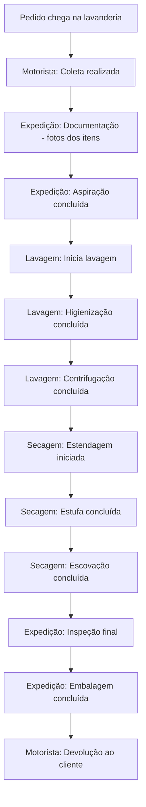

# 6. Perfis de Acesso

## 6.1 Filosofia de Permissões

O sistema de permissões do app segue três regras fundamentais:

1. **Multi-perfil**: Um usuário pode pertencer a um ou mais perfis, herdando as permissões de todos eles.
2. **Visibilidade de dados**: Equipes internas **NUNCA** veem preços ou valores financeiros. Apenas o admin tem acesso a dados financeiros.
3. **Dados do cliente**: Equipes internas veem apenas nome, endereço, telefone e instruções de coleta/entrega. Admin vê dados completos (CPF, e-mail, observações financeiras, etc.).

## 6.2 Perfis

| Perfil | Acesso | Telas | Vê preços? |
|--------|--------|-------|------------|
| **Admin** | Tudo — todas as fases, dados financeiros e de clientes | Todas | ✅ Sim |
| **Motorista** | F1 (etapas 1 e 12) + Rota do Dia + Almoxarifado | Dashboard Motorista, Rota, Coleta, Entrega, Almoxarifado | ❌ Não |
| **Expedição** | F1 (etapas 2-3: Documentação + Aspiração) + F4 (etapas 10-12: Inspeção + Embalagem) | Dashboard Expedição, Documentação, Kanban, Almoxarifado | ❌ Não |
| **Lavagem** | F2 (etapas 4-6) | Dashboard Lavagem, Kanban | ❌ Não |
| **Secagem** | F3 (etapas 7-9) | Dashboard Secagem, Kanban | ❌ Não |

### Multi-perfil (Combinações Possíveis)

Um usuário pode acumular múltiplos perfis. Exemplos:

| Usuário | Perfis | Acesso |
|---------|--------|--------|
| Proprietário | `admin` | Tudo |
| Gerente de produção | `expedicao` + `lavagem` + `secagem` | F1 + F2 + F3 + F4 (sem preços) |
| Motorista | `motorista` | Apenas coleta/entrega |
| Auxiliar geral | `expedicao` + `lavagem` | Documentação + Aspiração + Lavagem |
| Supervisor | `motorista` + `expedicao` | Coleta + Documentação + Inspeção |

## 6.3 Controle de Acesso

### Modelo JWT (multi-perfil)

```typescript
interface JwtPayload {
  id: number;
  nome: string;
  perfis: string[];        // Array de perfis: ['motorista', 'expedicao']
  transportadorId?: number; // se for motorista
  iat: number;
  exp: number;
}
```

### Middleware no Backend

```typescript
// middleware/perfil.middleware.ts
export function requirePerfil(...perfis: string[]) {
  return (req: Request, res: Response, next: NextFunction) => {
    if (!req.user || !req.user.perfis) {
      return res.status(403).json({
        success: false,
        error: { code: 'FORBIDDEN', message: 'Sem permissão para esta ação' },
      });
    }

    // Admin sempre passa
    if (req.user.perfis.includes('admin')) {
      return next();
    }

    // Verifica se o usuário tem PELO MENOS UM dos perfis exigidos
    const temPermissao = perfis.some(p => req.user.perfis.includes(p));
    if (!temPermissao) {
      return res.status(403).json({
        success: false,
        error: { code: 'FORBIDDEN', message: 'Você não tem permissão para esta ação' },
      });
    }
    next();
  };
}
```

### Modelo Usuário (banco de dados)

O campo `nivel` atual (string única) precisa evoluir para armazenar múltiplos perfis:

```prisma
model Usuario {
  id           Int      @id @default(autoincrement())
  nome         String
  email        String   @unique
  senha        String
  nivel        String   @default("operador")
  // "..."
  // O campo nivel continuará existindo para compatibilidade,
  // mas os perfis do app serão gerenciados por um novo campo:
  perfisApp    String?  @map("perfis_app") // JSON array: '["motorista","expedicao"]'
  // ou, alternativamente, criar tabela N:N:
  // usuarioPerfis UsuarioPerfil[]
}
```

**Recomendação:** Adicionar campo `perfisApp` (JSON array) à tabela `usuarios`, sem quebrar o `nivel` existente. O backend admin pode gerenciar isso.

## 6.4 Regras de Visibilidade de Dados

### O que NÃO é mostrado para perfis não-admin

| Informação | Admin | Motorista | Expedição | Lavagem | Secagem |
|------------|-------|-----------|-----------|---------|---------|
| Valor total do orçamento | ✅ | ❌ | ❌ | ❌ | ❌ |
| Valor de cada item | ✅ | ❌ | ❌ | ❌ | ❌ |
| Desconto PIX | ✅ | ❌ | ❌ | ❌ | ❌ |
| Parcelas / forma de pagamento | ✅ | ❌ | ❌ | ❌ | ❌ |
| Status de pagamento | ✅ | ❌ | ❌ | ❌ | ❌ |
| CPF / CNPJ do cliente | ✅ | ❌ | ❌ | ❌ | ❌ |
| E-mail do cliente | ✅ | ❌ | ❌ | ❌ | ❌ |
| Observações financeiras | ✅ | ❌ | ❌ | ❌ | ❌ |

### O que É mostrado para todos os perfis

| Informação | Admin | Motorista | Expedição | Lavagem | Secagem |
|------------|-------|-----------|-----------|---------|---------|
| Nome do cliente | ✅ | ✅ | ✅ | ✅ | ✅ |
| Endereço do cliente | ✅ | ✅ | ✅ | ❌ | ❌ |
| Telefone/WhatsApp | ✅ | ✅ | ✅ | ✅ | ✅ |
| Código do orçamento | ✅ | ✅ | ✅ | ✅ | ✅ |
| Itens do tapete (medidas, tipo) | ✅ | ✅ | ✅ | ✅ | ✅ |
| Fotos do estado inicial | ✅ | ✅ | ✅ | ✅ | ✅ |
| Status da etapa atual | ✅ | ✅ | ✅ | ✅ | ✅ |
| Observações de produção | ✅ | ✅ | ✅ | ✅ | ✅ |
| Datas (coleta, entrega) | ✅ | ✅ | ✅ | ✅ | ✅ |
| Instruções especiais | ✅ | ✅ | ✅ | ✅ | ✅ |

### Implementação no Backend

Os endpoints da API devem filtrar dados sensíveis baseado nos perfis do usuário:

```typescript
// services/orcamentos.service.ts
function filtrarDadosPorPerfil(orcamento: any, perfis: string[]) {
  if (perfis.includes('admin')) {
    return orcamento; // Retorna completo
  }

  // Remove campos financeiros
  const { valorTotal, valorPix, parcelas, valorParcela, formaPagamento,
          descontoPix, pixPayload, pixQrCode, gatewayStatus, statusPagamento,
          dataAceite, termosAceitos, ...dadosPermitidos } = orcamento;

  // Remove dados sensíveis do cliente
  if (dadosPermitidos.cliente) {
    const { cpf, cnpj, email, ...clientePermitido } = dadosPermitidos.cliente;
    dadosPermitidos.cliente = clientePermitido;
  }

  return dadosPermitidos;
}
```

## 6.5 Ações por Perfil (atualizado)

| Ação | Admin | Motorista | Lavagem | Secagem | Expedição |
|------|-------|-----------|---------|---------|-----------|
| Selecionar data da rota | ✅ | ✅ | ❌ | ❌ | ❌ |
| Gerar rota (RouteXL) | ✅ | ✅ | ❌ | ❌ | ❌ |
| Inverter ordem (Flip) | ✅ | ✅ | ❌ | ❌ | ❌ |
| Salvar rota | ✅ | ✅ | ❌ | ❌ | ❌ |
| Ver rota do dia | ✅ | ✅ | ❌ | ❌ | ❌ |
| Ver mapa da rota | ✅ | ✅ | ❌ | ❌ | ❌ |
| Navegar para endereço (Maps) | ✅ | ✅ | ❌ | ❌ | ❌ |
| Coletar tapete | ✅ | ✅ | ❌ | ❌ | ❌ |
| Entregar tapete | ✅ | ✅ | ❌ | ❌ | ❌ |
| Documentar (fotos + itens) | ✅ | ❌ | ❌ | ❌ | ✅ |
| Aspirar tapete | ✅ | ❌ | ❌ | ❌ | ✅ |
| Iniciar lavagem | ✅ | ❌ | ✅ | ❌ | ❌ |
| Iniciar secagem | ✅ | ❌ | ❌ | ✅ | ❌ |
| Inspecionar | ✅ | ❌ | ❌ | ❌ | ✅ |
| Embalar | ✅ | ❌ | ❌ | ❌ | ✅ |
| Avançar qualquer etapa | ✅ | ❌ | ❌ | ❌ | ❌ |
| Ver kanban completo | ✅ | ✅ | ✅ | ✅ | ✅ |
| Carregar no veículo | ✅ | ✅ | ❌ | ❌ | ✅ |
| **Ver preços** | ✅ | ❌ | ❌ | ❌ | ❌ |
| **Ver dados financeiros** | ✅ | ❌ | ❌ | ❌ | ❌ |
| **Ver CPF/CNPJ do cliente** | ✅ | ❌ | ❌ | ❌ | ❌ |

## 6.6 Fluxo de Trabalho do Motorista

```mermaid
flowchart TD
    A[Motorista loga no app] --> B[App exibe lista de coletas do dia]
    B --> C[Motorista solicita rota otimizada]
    C --> D[Backend consulta RouteXL]
    D --> E[App exibe mapa com rota]
    E --> F[Motorista percorre rota]
    F --> G[Em cada parada: confirma coleta]
    G --> H[App atualiza status no backend]
    H --> I[Após todas as coletas: retorna à base]
    I --> J[Motorista marca serviços como "carregados"]
    J --> K[App exibe lista de devoluções]
    K --> L[Motorista percorre rota de devolução]
    L --> M[Em cada parada: confirma entrega + assinatura]
    M --> N[App atualiza status para "devolvido"]
```

## 6.7 Fluxo de Trabalho da Equipe Interna


