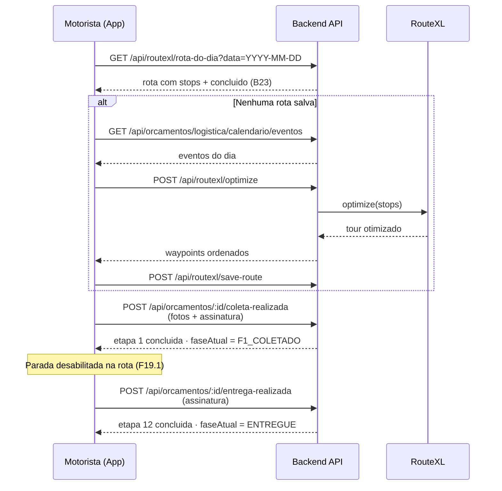
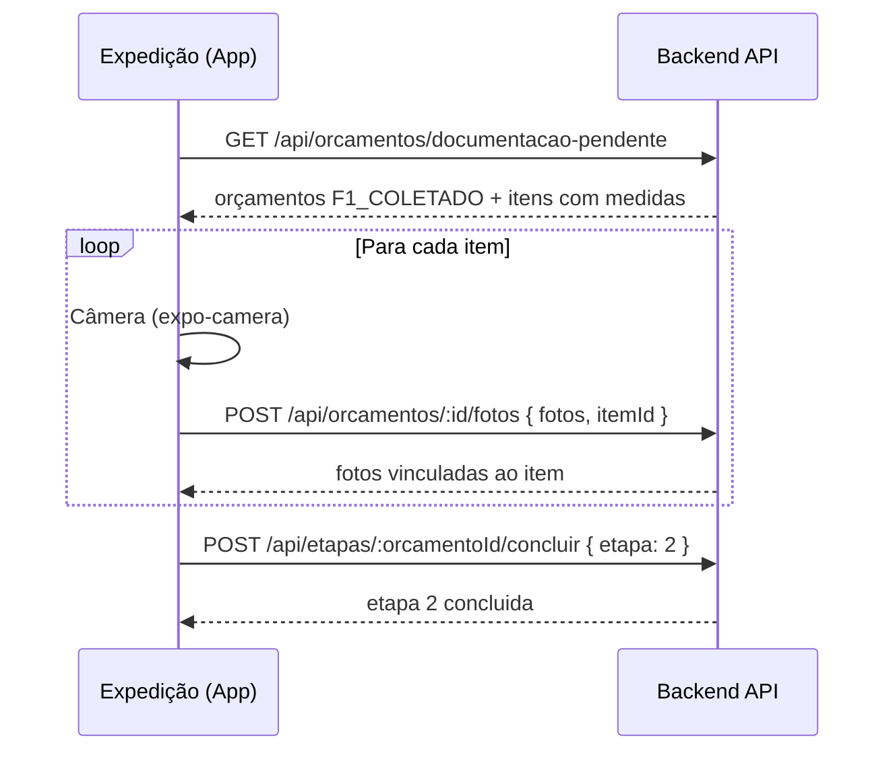
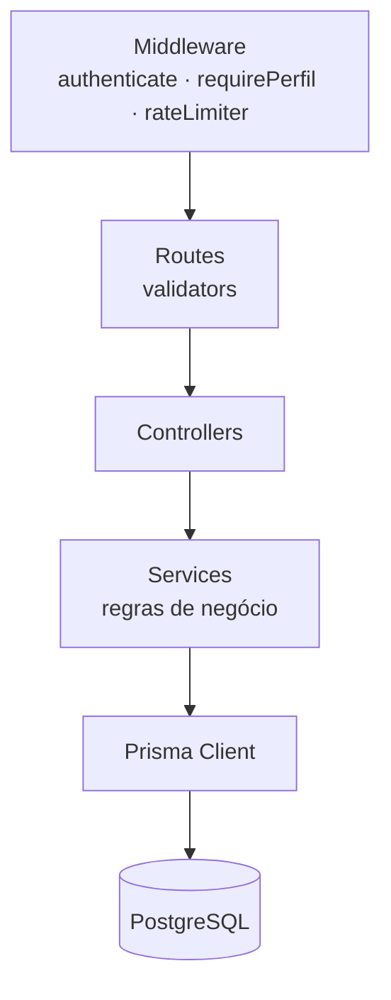

# 🧩 Diagramas — umarizal.app

> **Agente:** UMLArchitectGPT — Diagramas de classes e sequência (Fase 2, #10)
> **Status:** ✅ Validado — arquitetura e fluxos desenhados conforme o código real

## 🏛️ Visão Geral das Entidades (Modelo de Dados)

```mermaid
flowchart LR
    U[Usuario<br/>perfisApp: string[]] --> T[Transportador<br/>usuarioId FK]
    T --> O[Orcamento<br/>faseAtual]
    O --> E[EtapaProducao<br/>etapa 1-12 · unique orcamentoId+etapa]
    O --> C[CarregamentoVeiculo<br/>orcamentoId unique]
    O --> I[OrcamentoItem<br/>medidas]
    O --> F[Fotos<br/>itemId opcional]
```

> Diagrama corresponde ao `prisma/schema.prisma` do backend (models `Usuario`, `Transportador`, `Orcamento`, `EtapaProducao`, `CarregamentoVeiculo`, `OrcamentoItem`, `OrcamentoFoto`).

## 🔄 Sequência — Fluxo do Motorista (Rota do Dia → Coleta → Entrega)



## 🔄 Sequência — Documentação de Entrada (Expedição)



## 🏗️ Arquitetura de Camadas (Backend)



<!-- Créditos: RepoCreditsAdderGPT — documentação padronizada · UMLArchitectGPT — diagramas -->
