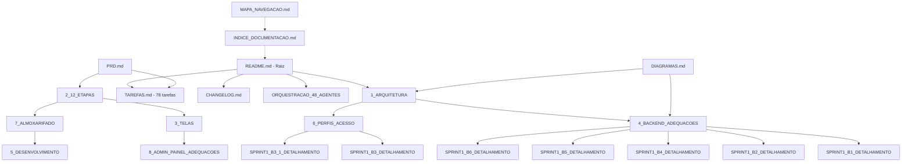

# 🕸️ Mapa de Navegação — umarizal.app

> **Agente:** ObsidianArchitectGPT — Arquitetura do Grafo (Fase 2, #8)
> **Status:** ✅ Validado — grafo de conhecimento atualizado

## 🌐 Grafo de Documentos

## 🧭 Como navegar

| Se você quer... | Comece por |
|-----------------|------------|
| Entender o projeto rapidamente | `README.md` → `1_ARQUITETURA.md` |
| Saber o que está implementado/pendente | `TAREFAS.md` |
| Ver o fluxo das 12 etapas | `2_12_ETAPAS.md` |
| Ver as telas por perfil | `3_TELAS.md` |
| Entender permissões e privacidade | `6_PERFIS_ACESSO.md` |
| Ver o histórico de versões | `CHANGELOG.md` |
| Acompanhar a validação dos 48 agentes | `ORQUESTRACAO_48_AGENTES.md` |

## 🔁 Manutenção do grafo

- Novos documentos devem ser registrados em `INDICE_DOCUMENTACAO.md` e ligados no grafo acima
- Documentos obsoletos devem ser marcados e removidos do grafo
- Revisão a cada fase concluída da orquestração

<!-- Créditos: RepoCreditsAdderGPT — documentação padronizada · ObsidianArchitectGPT — grafo de conhecimento -->
