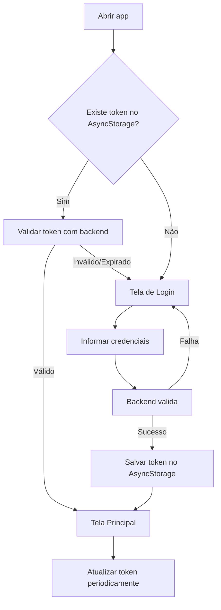
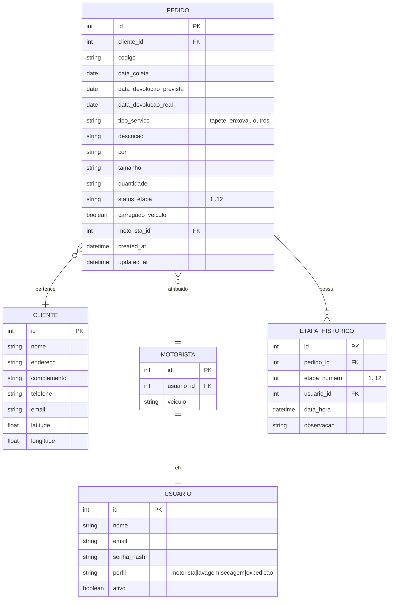

# Plano de Desenvolvimento – App de Controle Logístico Lavanderia Umarizal

## 1. Visão Geral do Projeto

### 1.1. Objetivo
Substituir a planilha manual de controle de coleta e devolução por um aplicativo mobile nativo (React Native / Expo) totalmente integrado ao backend existente, que gerencie todo o fluxo logístico e operacional da lavanderia, abrangendo:

- **Fase 1 – Coleta e Preparo** (etapas 1, 2, 3)
- **Fase 2 – Lavagem e Higienização** (etapas 4, 5, 6)
- **Fase 3 – Secagem e Escovação** (etapas 7, 8, 9)
- **Fase 4 – Finalização e Entrega** (etapas 10, 11, 12)

### 1.2. Público-Alvo
- Motoristas / equipe de logística (coleta e devolução)
- Equipe interna da lavanderia (lavagem, secagem, expedição)

### 1.3. Premissas
- O aplicativo **não será publicado** na Google Play ou Apple Store – será gerado e distribuído localmente (APK/IPA).
- **Login persistente**: uma vez logado, o usuário permanece autenticado até desinstalar o app ou limpar os dados/cache.
- O app consome **APIs do backend existente** e complementa com novas rotas conforme necessário.
- A rota do dia é otimizada via **API do RouteXL**.
- O backend e o site já possuem a maior parte das informações de clientes, pedidos e serviços.

---

## 2. Estrutura do Aplicativo (Frontend Mobile)

### 2.1. Tecnologias Sugeridas
| Camada | Tecnologia |
|--------|------------|
| Framework | React Native + Expo (ou bare React Native) |
| Navegação | React Navigation (Stack + Bottom Tabs) |
| Armazenamento local | AsyncStorage (para token/sessão) + MMKV (opcional, para melhor performance) |
| Estado global | Context API ou Zustand/Redux Toolkit |
| Requisições HTTP | Axios |
| Mapas/Rotas | React Native Maps + integração com RouteXL API |
| Câmera/Scanner | react-native-camera ou expo-camera (para ler códigos de barras, se necessário) |
| Push notifications | (opcional) para notificar mudanças de status |

### 2.2. Fluxo de Autenticação e Sessão Persistente



**Implementação:**
- No primeiro login, o token JWT (ou session token) é armazenado no **AsyncStorage**.
- Ao abrir o app, verifica-se a existência do token e, se presente, tenta-se validá-lo com o backend.
- Se o token for válido, o usuário é direcionado à tela principal sem reautenticação.
- O token pode ter um tempo de expiração longo ou ser renovado automaticamente via refresh token.
- **Logout** só ocorre por ação explícita do usuário (botão "Sair") ou se o token for revogado no backend.

### 2.3. Telas e Funcionalidades por Perfil

| Perfil | Telas/Funcionalidades |
|--------|------------------------|
| **Motorista/Logística** | – Lista de coletas do dia <br> – Visualização de rota otimizada (RouteXL) <br> – Botão "Coletado" (atualiza status no backend) <br> – Lista de devoluções do dia <br> – Botão "Entregue" (atualiza status) <br> – Flag "Carregado no veículo" (entrada no carro) |
| **Lavagem** | – Lista de pedidos em "Aguardando Lavagem" <br> – Botão "Em Lavagem" (etapa 4) <br> – Botão "Higienizado" (etapa 5) <br> – Botão "Centrifugado" (etapa 6) |
| **Secagem** | – Lista de pedidos em "Aguardando Secagem" <br> – Botão "Estendido" (etapa 7) <br> – Botão "Em Estufa" (etapa 8) <br> – Botão "Escovado" (etapa 9) |
| **Expedição** | – Lista de pedidos em "Aguardando Expedição" <br> – Botão "Inspeção Final" (etapa 10) <br> – Botão "Embalado" (etapa 11) <br> – Botão "Devolução" (etapa 12) |

---

## 3. Backend – Modificações e Novas Rotas Necessárias

### 3.1. Modelos de Dados (Entidades)

Com base na planilha descrita e no fluxo de 12 etapas, o backend deve contemplar:



### 3.2. Novas Rotas API (Sugestão)

| Método | Rota | Descrição |
|--------|------|-----------|
| `GET` | `/api/pedidos/hoje/coleta` | Lista pedidos com coleta agendada para hoje |
| `GET` | `/api/pedidos/hoje/devolucao` | Lista pedidos com devolução agendada para hoje |
| `GET` | `/api/pedidos/:id` | Detalhes completos do pedido |
| `PATCH` | `/api/pedidos/:id/status` | Atualiza a etapa atual do pedido (1 a 12) |
| `PATCH` | `/api/pedidos/:id/carregado` | Marca/desmarca o flag "carregado no veículo" |
| `PATCH` | `/api/pedidos/:id/coletado` | Registra data/hora da coleta |
| `PATCH` | `/api/pedidos/:id/entregue` | Registra data/hora da devolução + assinatura digital |
| `GET` | `/api/roteiro/dia` | Retorna lista de endereços para roteirização (usado pelo RouteXL) |
| `POST` | `/api/roteiro/otimizado` | Envia lista de endereços para RouteXL e retorna rota otimizada |
| `GET` | `/api/usuarios/perfil` | Retorna perfil do usuário logado |
| `POST` | `/api/auth/login` | Autenticação e geração de token |
| `POST` | `/api/auth/refresh` | Renovação de token |
| `POST` | `/api/auth/logout` | Invalida token (opcional) |

### 3.3. Integração com RouteXL

- O backend deve armazenar **latitude e longitude** de cada cliente (via geocoding na criação/atualização).
- A rota do dia é construída a partir da lista de pedidos com coleta ou devolução pendente.
- O backend chama a API do RouteXL **apenas quando necessário** (ex.: ao iniciar o dia, ou quando o motorista solicitar).
- **Endpoint RouteXL**: `POST https://www.routexl.com/api/tour` com autenticação Basic Auth (username/password).
- O RouteXL aceita até **10 localizações por requisição** no plano gratuito; acima disso é necessário upgrade.
- O backend processa a resposta e devolve ao app a ordem otimizada das paradas.

### 3.4. Endpoints da API RouteXL (para referência)

| Rota | Método | Descrição |
|------|--------|-----------|
| `/api/status` | GET | Verifica status da API e limite de localizações |
| `/api/distances` | POST | Retorna matriz de distâncias entre localizações |
| `/api/tour` | POST | Retorna rota otimizada com ordem das paradas |

**Exemplo de requisição para `/api/tour`** (JSON):
```json
{
  "locations": [
    {"address": "Cliente A", "lat": -23.5505, "lng": -46.6333},
    {"address": "Cliente B", "lat": -23.5605, "lng": -46.6433}
  ]
}
```

---

## 4. Site – Modificações Necessárias

O site institucional (`lavanderiaumarizal.com.br`) já possui a página com as 12 etapas. Para integração com o app, são sugeridas as seguintes alterações:

1. **Área do Cliente** (se existir):
   - Exibir o status atual do pedido (etapa em que se encontra).
   - Mostrar a data prevista de devolução.
   - Permitir que o cliente acompanhe em tempo real (via consulta ao backend).

2. **Painel Administrativo** (se existir):
   - Visualização consolidada de todos os pedidos com seus respectivos status.
   - Dashboard com indicadores de performance (tempo médio por etapa, etc.).

3. **Geocoding**:
   - Ao cadastrar/atualizar um cliente, o site deve disparar uma geocodificação (Google Maps Geocoding API ou similar) para armazenar lat/lng no backend.

4. **Webhook/Notificações**:
   - Opcional: enviar notificações por e-mail/SMS ao cliente quando o pedido mudar de etapa (ex.: "Seu tapete entrou na fase de secagem").

---

## 5. Estrutura de Diretórios do Projeto (Sugestão)

```
/app-logistica-umarizal/
├── @doc/                         # Documentação do projeto
│   ├── plano-desenvolvimento.md  # Este documento
│   ├── api-spec.yaml             # Especificação OpenAPI das rotas
│   ├── database-schema.sql       # Scripts de migração do banco
│   └── wireframes/               # Mockups das telas
├── backend/                      # Código do backend (Node.js/PHP/etc.)
│   ├── src/
│   │   ├── controllers/
│   │   ├── models/
│   │   ├── routes/
│   │   ├── services/
│   │   │   ├── routexl.service.js
│   │   │   └── auth.service.js
│   │   └── utils/
│   └── package.json
├── mobile/                       # Código do app React Native
│   ├── src/
│   │   ├── components/
│   │   ├── screens/
│   │   ├── navigation/
│   │   ├── context/              # AuthContext, etc.
│   │   ├── services/             # API client
│   │   └── utils/
│   ├── App.js
│   └── app.json
└── site/                         # Código do site (se for gerenciado no mesmo repo)
    └── ...
```

---

## 6. Fluxo de Trabalho do Motorista (Exemplo)

```mermaid
flowchart TD
    A[Motorista loga no app] --> B[App exibe lista de coletas do dia]
    B --> C[Motorista solicita rota otimizada]
    C --> D[Backend consulta RouteXL]
    D --> E[App exibe mapa com rota]
    E --> F[Motorista percorre rota]
    F --> G[Em cada parada: confirma coleta]
    G --> H[App atualiza status no backend]
    H --> I[Após todas as coletas: retorna à base]
    I --> J[Motorista marca serviços como "carregados"]
    J --> K[App exibe lista de devoluções]
    K --> L[Motorista percorre rota de devolução]
    L --> M[Em cada parada: confirma entrega + assinatura]
    M --> N[App atualiza status para "devolvido"]
```

---

## 7. Fluxo de Trabalho da Equipe Interna (Exemplo)

```mermaid
flowchart TD
    A[Pedido chega na lavanderia] --> B[Status: Coletado]
    B --> C[Lavagem: atualiza para "Em Lavagem"]
    C --> D[Lavagem: atualiza para "Higienizado"]
    D --> E[Lavagem: atualiza para "Centrifugado"]
    E --> F[Secagem: atualiza para "Estendido"]
    F --> G[Secagem: atualiza para "Em Estufa"]
    G --> H[Secagem: atualiza para "Escovado"]
    H --> I[Expedição: atualiza para "Inspeção Final"]
    I --> J[Expedição: atualiza para "Embalado"]
    J --> K[Expedição: atualiza para "Devolução"]
```

---

## 8. Considerações de Segurança

- **Autenticação**: todas as rotas da API (exceto `/login` e `/refresh`) devem exigir token JWT no header `Authorization: Bearer <token>`.
- **Tokens**: utilizar **refresh token** para manter a sessão ativa por longos períodos sem expor o token principal.
- **Armazenamento local**: o token deve ser armazenado de forma segura. Em produção, recomenda-se o uso de **react-native-keychain** (iOS/Android Keystore) em vez de AsyncStorage para tokens sensíveis.
- **HTTPS obrigatório**: todas as comunicações entre app e backend devem ser via HTTPS.
- **Controle de perfil**: cada usuário só pode visualizar e atualizar os pedidos compatíveis com seu perfil (motorista, lavagem, secagem, expedição).

---

## 9. Plano de Entregas (Sugestão)

| Fase | Entregáveis | Prazo Estimado |
|------|-------------|----------------|
| **Fase 0 – Planejamento** | – Documento de requisitos (este) <br> – Modelagem do banco <br> – Especificação da API | 1 semana |
| **Fase 1 – Backend** | – Novas rotas implementadas <br> – Integração com RouteXL <br> – Migrações do banco | 2 semanas |
| **Fase 2 – App (Login + Motorista)** | – Tela de login com persistência <br> – Lista de coletas/devoluções <br> – Rota otimizada com mapa | 3 semanas |
| **Fase 3 – App (Equipe Interna)** | – Telas para lavagem, secagem, expedição <br> – Atualização de status por etapa | 2 semanas |
| **Fase 4 – Site** | – Painel de acompanhamento <br> – Área do cliente (se aplicável) | 2 semanas |
| **Fase 5 – Testes e Homologação** | – Testes integrados <br> – Ajustes finos | 1 semana |
| **Fase 6 – Distribuição** | – Geração de APK/IPA <br> – Instalação nos dispositivos | 1 semana |

---

## 10. Próximos Passos

1. **Levantamento detalhado do backend atual**:
   - Quais tabelas/coleções já existem?
   - Quais campos já estão disponíveis?
   - Qual é o stack tecnológico (Node.js, PHP, Python, etc.)?

2. **Definir a estratégia de geocodificação**:
   - Os clientes já possuem latitude/longitude? Se não, como serão obtidas?

3. **Criar as migrações do banco** para incluir:
   - `pedido.etapa_atual` (int 1-12)
   - `pedido.carregado_veiculo` (boolean)
   - `pedido.motorista_id` (FK)
   - Tabela `etapa_historico`

4. **Implementar as rotas prioritárias** (login, listagem de pedidos do dia, atualização de status).

5. **Iniciar o desenvolvimento do app** com foco na experiência do motorista (Fase 2).

---

> **Nota**: Este plano é um guia inicial e deve ser ajustado conforme o conhecimento detalhado do backend e do site existentes. Recomenda-se uma reunião de alinhamento com a equipe de desenvolvimento para validar as premissas e prioridades.
