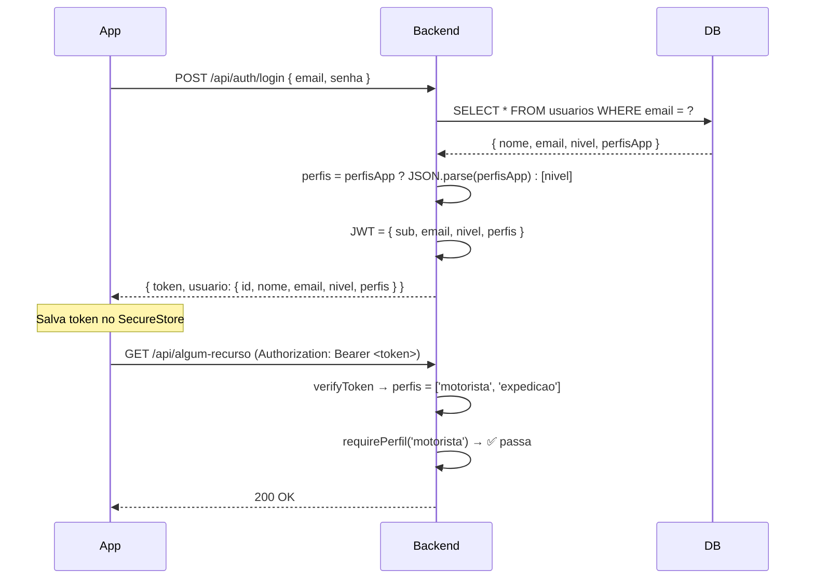

# Plano de Implementação — B3: Expandir sistema de permissões para multi-perfil

## 1. O que precisa ser feito

Expandir o sistema de permissões do backend para suportar **múltiplos perfis por usuário** (array de strings), mantendo compatibilidade com o campo `nivel` existente.

**Estado atual:** Cada usuário tem 1 único `nivel` (admin, operador, motorista, etc.)
**Estado desejado:** Cada usuário pode ter **N perfis** (ex: `["motorista", "expedicao"]`), herdando permissões de todos.

### Regras de Negócio

| Regra | Descrição |
|-------|-----------|
| **Multi-perfil** | Um usuário pode ter 0, 1 ou N perfis simultaneamente |
| **Admin sempre passa** | Se o array incluir `"admin"`, o middleware libera qualquer ação |
| **Fallback legado** | Se `perfisApp` for NULL, usa `[nivel]` como fallback (compatibilidade) |
| **Sem quebra** | Usuários existentes (sem `perfisApp`) continuam funcionando normalmente |
| **Painel admin** | A gestão visual dos perfis será feita em tarefa A9/A10 (pós-app) |

---

## 2. Arquivos que serão alterados

| # | Arquivo | Ação | Impacto |
|---|---------|------|---------|
| 1 | `prisma/schema.prisma` | Adicionar campo `perfisApp` ao model `Usuario` | 🟢 Baixo |
| 2 | `src/types/index.ts` | `AuthPayload.perfis`, `CreateUsuarioInput.perfisApp`, `Request.user.perfis` | 🟡 Médio |
| 3 | `src/lib/jwt.ts` | Incluir `perfis` no token JWT | 🟡 Médio |
| 4 | `src/services/auth.service.ts` | `login` retorna `perfis`. `createUsuario` salva `perfisApp`. `updateUsuario` altera `perfisApp`. Todos os `select` incluem `perfisApp` | 🔴 Alto |
| 5 | `src/controllers/auth.controller.ts` | Endpoints de listagem/consulta retornam `perfisApp` | 🟢 Baixo |
| 6 | `src/routes/auth.routes.ts` | Novo endpoint `PATCH /:id/perfis` (B3.1) | 🟢 Baixo |
| 7 | `src/middleware/permissions.ts` | Nova função `requirePerfil(...perfis)` | 🟡 Médio |
| 8 | `src/validators/auth.validator.ts` | `createUsuarioSchema` aceita `perfisApp` | 🟢 Baixo |

---

## 3. Alterações detalhadas

### 3.1 Schema Prisma — Adicionar campo

```prisma
model Usuario {
  id           Int      @id @default(autoincrement())
  nome         String
  email        String   @unique
  senha        String
  nivel        String   @default("operador")
  // NOVO: JSON array de perfis do app, ex: '["motorista","expedicao"]'
  perfisApp    String?  @map("perfis_app")
  ativo        Boolean  @default(true)
  criadoEm     DateTime @default(now()) @map("criado_em")
  atualizadoEm DateTime @updatedAt @map("atualizado_em")

  transportador Transportador?
  carregamentos CarregamentoVeiculo[]

  @@map("usuarios")
}
```

**Localização exata:** após `nivel` (linha 24), antes de `ativo` (linha 25).

### 3.2 SQL da Migration

```sql
-- AddColumn: perfis_app na tabela usuarios
ALTER TABLE "usuarios" ADD COLUMN IF NOT EXISTS "perfis_app" TEXT;
```

Apenas 1 linha. Campo opcional (nullable) — não quebra registros existentes.

### 3.3 Types — AuthPayload, CreateUsuarioInput, Request.user

```typescript
// types/index.ts

// Extensão do Request do Express
declare global {
  namespace Express {
    interface Request {
      user?: {
        id: number | string;
        nome: string;
        email: string;
        nivel: string;
        perfis?: string[];  // NOVO
      };
    }
  }
}

export type CreateUsuarioInput = {
  nome: string;
  email: string;
  senha: string;
  nivel?: string;
  perfisApp?: string[];  // NOVO
  ativo?: boolean;
};

export type AuthPayload = {
  sub: number | string;
  email: string;
  nivel: string;
  perfis: string[];  // NOVO (mudou de obrigatório — antes não existia)
  clienteId?: string;
};
```

### 3.4 JWT — Incluir `perfis` no token

```typescript
// lib/jwt.ts

export function generateToken(payload: AuthPayload, expiresIn: string | number = '24h'): string {
  const secret = getSecret();
  return jwt.sign(payload, secret, { expiresIn: expiresIn as any });
}

export function verifyToken(token: string): AuthPayload | null {
  try {
    const secret = getSecret();
    const decoded = jwt.verify(token, secret) as jwt.JwtPayload & AuthPayload;
    
    return {
      sub: decoded.sub as number | string,
      email: decoded.email,
      nivel: decoded.nivel,
      perfis: decoded.perfis || [decoded.nivel],  // Fallback: se não tem perfis, usa nivel
    };
  } catch (error) {
    return null;
  }
}
```

### 3.5 Auth Service — Login, Create, Update

#### Função auxiliar (nova)

```typescript
// Extrai o array de perfis do usuário, com fallback para nivel
function getPerfisFromUsuario(usuario: { nivel: string; perfisApp: string | null }): string[] {
  if (usuario.perfisApp) {
    try {
      return JSON.parse(usuario.perfisApp);
    } catch {
      return [usuario.nivel]; // Fallback se JSON inválido
    }
  }
  return [usuario.nivel]; // Fallback: usa nivel como único perfil
}
```

#### Login — retornar perfis

```typescript
export async function login(input: LoginInput) {
  // ... validações existentes ...

  const perfis = getPerfisFromUsuario(usuario);

  const payload: AuthPayload = {
    sub: usuario.id,
    email: usuario.email,
    nivel: usuario.nivel,
    perfis,  // NOVO
  };

  const token = generateToken(payload, '3d');

  return {
    token,
    usuario: {
      id: usuario.id,
      nome: usuario.nome,
      email: usuario.email,
      nivel: usuario.nivel,
      perfis,  // NOVO
    },
  };
}
```

#### CreateUsuario — salvar perfisApp

```typescript
export async function createUsuario(input: CreateUsuarioInput) {
  // ... validações existentes ...

  const usuario = await prisma.usuario.create({
    data: {
      nome: input.nome,
      email: input.email,
      senha: senhaHash,
      nivel: input.nivel || 'operador',
      perfisApp: input.perfisApp ? JSON.stringify(input.perfisApp) : null,  // NOVO
      ativo: input.ativo !== undefined ? input.ativo : true,
    },
    select: {
      id: true,
      nome: true,
      email: true,
      nivel: true,
      perfisApp: true,  // NOVO
      ativo: true,
      criadoEm: true,
    },
  });

  return {
    ...usuario,
    perfis: usuario.perfisApp ? JSON.parse(usuario.perfisApp) : [usuario.nivel],
  };
}
```

#### UpdateUsuario — aceitar perfisApp

```typescript
export async function updateUsuario(id: number, data: Partial<CreateUsuarioInput>) {
  // ... validações existentes ...
  
  const updateData: any = {};
  if (data.nome) updateData.nome = data.nome;
  if (data.email) { /* ... */ }
  if (data.senha) { /* ... */ }
  if (data.nivel) updateData.nivel = data.nivel;
  if (data.perfisApp !== undefined) {                          // NOVO
    updateData.perfisApp = JSON.stringify(data.perfisApp);     // NOVO
  }
  if (data.ativo !== undefined) updateData.ativo = data.ativo;
  
  // ... update e return ...
}
```

#### ListUsuarios / GetUsuarioById — incluir perfisApp no select

```typescript
select: {
  id: true,
  nome: true,
  email: true,
  nivel: true,
  perfisApp: true,  // NOVO
  ativo: true,
  criadoEm: true,
  atualizadoEm: true,
},
```

### 3.6 Auth Controller — Retornar perfis

```typescript
// controllers/auth.controller.ts
// O me() já usa getUsuarioById — como o select agora inclui perfisApp,
// a resposta automaticamente terá perfisApp. 
// Opcional: transformar perfisApp em perfis[] na resposta.

export async function me(req: Request, res: Response, next: NextFunction) {
  try {
    if (!req.user) { /* ... */ }
    const usuario = await authService.getUsuarioById(Number(req.user.id));
    // Transforma perfisApp JSON → array
    const result = {
      ...usuario,
      perfis: usuario.perfisApp ? JSON.parse(usuario.perfisApp) : [usuario.nivel],
    };
    sendSuccess(res, result);
  } catch (err) {
    next(err);
  }
}
```

### 3.7 Middleware — `requirePerfil()`

```typescript
// middleware/permissions.ts

/**
 * NOVO: Permite apenas usuários com pelo menos 1 dos perfis informados.
 * Admin (perfil 'admin') sempre passa.
 * @param perfis - Array de perfis permitidos (ex: requirePerfil('motorista', 'expedicao'))
 */
export function requirePerfil(...perfis: string[]) {
  return (req: Request, res: Response, next: NextFunction): void => {
    if (!req.user) {
      return sendError(res, 401, 'UNAUTHORIZED', 'Não autenticado');
    }

    // Obtém perfis do usuário (fallback: [nivel])
    const userPerfis = req.user.perfis || [req.user.nivel];

    // Admin sempre tem acesso
    if (userPerfis.includes('admin')) {
      return next();
    }

    // Verifica se tem PELO MENOS UM dos perfis exigidos
    const temAcesso = perfis.some(p => userPerfis.includes(p));
    if (!temAcesso) {
      return sendError(res, 403, 'FORBIDDEN', 'Sem permissão para esta ação');
    }

    next();
  };
}
```

### 3.8 Validator — Schema atualizado

```typescript
// validators/auth.validator.ts

export const createUsuarioSchema = z.object({
  nome: z.string({ message: 'Nome é obrigatório' }).min(2).max(255),
  email: z.string({ message: 'Email é obrigatório' }).email('Email inválido').max(255),
  senha: z.string({ message: 'Senha é obrigatória' }).min(8).max(128),
  nivel: z.enum(['admin', 'operador', 'motorista', 'financeiro', 'marketing', 'atendimento', 'cliente'])
    .optional().default('operador'),
  perfisApp: z.array(z.enum(['admin', 'motorista', 'expedicao', 'lavagem', 'secagem']))  // NOVO
    .optional().default([]),
  ativo: z.boolean().optional().default(true),
});
```

> **Nota:** Os perfis do app (`motorista`, `expedicao`, `lavagem`, `secagem`) são diferentes dos níveis do backend (`admin`, `operador`, `financeiro`, etc.). O `nivel` continua sendo o nível do painel admin, enquanto `perfisApp` são os perfis do app mobile.

---

## 4. Fluxo de Autenticação com Multi-perfil



---

## 5. Tabela de Compatibilidade Retroativa

| Cenário | `nivel` | `perfisApp` | `getPerfisFromUsuario()` retorna |
|---------|---------|-------------|----------------------------------|
| Admin antigo | `"admin"` | `NULL` | `["admin"]` |
| Motorista antigo | `"motorista"` | `NULL` | `["motorista"]` |
| Novo multi-perfil | `"operador"` | `'["motorista","expedicao"]'` | `["motorista","expedicao"]` |
| Admin + perfil | `"admin"` | `'["admin"]'` | `["admin"]` |
| JSON inválido | `"operador"` | `"abc"` | `["operador"]` (fallback seguro) |

---

## 6. Procedimento de Deploy

```bash
# Passo 1: No container de produção
cd /app

# Passo 2: Executar SQL da migration
echo 'ALTER TABLE "usuarios" ADD COLUMN IF NOT EXISTS "perfis_app" TEXT;' | npx prisma db execute --stdin

# Passo 3: Criar migration folder
mkdir -p prisma/migrations/20260731000001_add_perfis_app

cat > prisma/migrations/20260731000001_add_perfis_app/migration.sql << 'EOF'
-- AddColumn: perfis_app na tabela usuarios
ALTER TABLE "usuarios" ADD COLUMN IF NOT EXISTS "perfis_app" TEXT;
EOF

# Passo 4: Marcar como applied
npx prisma migrate resolve --applied 20260731000001_add_perfis_app

# Passo 5: Gerar client
npx prisma generate

# Passo 6: Testar (opcional)
node -e "
const p = require('./src/generated/prisma/client');
console.log('Prisma client carregado com sucesso');
"
```

---

## 7. Testes de Validação

Após o deploy, testar estes cenários:

| # | Cenário | Como testar | Resultado esperado |
|---|---------|-------------|-------------------|
| T1 | Login de admin antigo | `POST /api/auth/login` com admin existente | `perfis: ["admin"]` no response |
| T2 | Login de motorista antigo | `POST /api/auth/login` com motorista existente | `perfis: ["motorista"]` no response |
| T3 | Criar usuário multi-perfil | `POST /api/usuarios/register` com `perfisApp: ["motorista","expedicao"]` | Usuário criado com `perfisApp` salvo |
| T4 | Listar usuários | `GET /api/usuarios/` | Cada usuário mostra `perfisApp` |
| T5 | JWT contém perfis | Decodificar token manualmente | `perfis` presente no payload |
| T6 | Middleware bloqueia | `requirePerfil('admin')` com token de motorista | 403 Forbidden |
| T7 | Admin sempre passa | `requirePerfil('lavagem')` com token de admin | 200 OK |

---

## 8. Riscos e Atenção (lições da B1/B2)

| Risco | Impacto | Mitigação |
|-------|---------|-----------|
| **Middleware existente** 🟡 | `requireNivel` e `requireAdmin` usam `req.user.nivel` — precisam continuar funcionando | `requirePerfil()` é NOVO — funções antigas NÃO são alteradas |
| **Fallback `[nivel]`** 🟢 | Usuários sem `perfisApp` funcionam com `[nivel]` como único perfil | `getPerfisFromUsuario()` trata NULL, JSON inválido e string vazia |
| **Validator enum** 🟡 | Perfis do app (`expedicao`, `lavagem`, `secagem`) NÃO existem no validator atual | Adicionar ao enum do `createUsuarioSchema` |
| **Entrypoint** 🟢 | B3 não cria tabela, apenas ALTER COLUMN | `ALTER TABLE ADD COLUMN IF NOT EXISTS` é idempotente |
| **Nível vs Perfil** 🟡 | Confusão entre `nivel` (admin/operador) e `perfisApp` (motorista/expedicao) | Documentar claramente: `nivel` é do painel admin, `perfisApp` é do app |

---

## 9. Dependências

```
B3 (este) → B3.1 (endpoint perfis) → B4 (login unificado rememberMe)
B3 (este) → B15 (middleware requirePerfil)

B3 precisa ser concluída **antes** de B4 (login unificado) e B15 (middleware), pois ambos dependem do campo `perfisApp` e da função `getPerfisFromUsuario()`.
