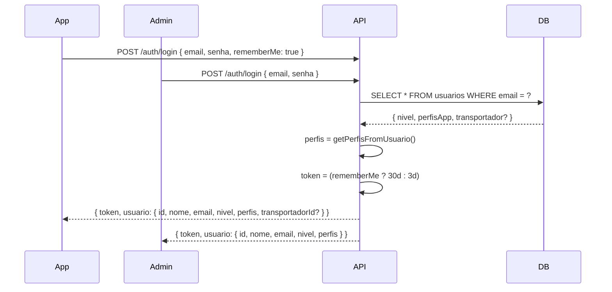

# Plano de Implementação — B4: Login unificado com `rememberMe` e `transportadorId`

## 1. O que precisa ser feito

Adaptar o endpoint `POST /api/auth/login` existente para atender **todos os perfis** (admin, motorista, lavagem, secagem, expedição) em vez de criar um endpoint separado `login-motorista`.

O mesmo endpoint serve **tanto o painel admin web quanto o app mobile** — a diferença é que o app envia `rememberMe: true` para receber um token de longa duração (30 dias).

### Motivação da mudança

Antes (documentação original) a B4 criaria um endpoint separado `POST /api/auth/login-motorista` com `{ cpf, senha }`. Com o multi-perfil (B3) já implantado, essa separação não é necessária:

| Motivo | Explicação |
|--------|------------|
| **Multi-perfil** | O login já retorna `perfis: ["motorista"]` — o app sabe o que mostrar |
| **Email existe** | Motoristas já têm email (via model `Usuario`) — não precisam de login por CPF |
| **Menos código** | Um endpoint = menos rotas, menos controllers, menos testes |
| **Admin usa o mesmo** | O painel admin continua funcionando sem nenhuma alteração |

### Fluxo



---

## 2. Arquivos que serão alterados

| # | Arquivo | Ação | Impacto |
|---|---------|------|---------|
| 1 | `src/validators/auth.validator.ts` | Adicionar `rememberMe?: boolean` ao `loginSchema` | 🟢 |
| 2 | `src/services/auth.service.ts` | `login()` aceitar `rememberMe`, incluir `transportadorId` | 🟡 |
| 3 | `src/types/index.ts` | Adicionar `rememberMe?: boolean` ao `LoginInput` | 🟢 |

**Nenhum arquivo novo** — apenas adaptações no endpoint existente.

---

## 3. Código

### 3.1 Types — LoginInput

```typescript
// types/index.ts
export type LoginInput = {
  email: string;
  senha: string;
  rememberMe?: boolean;  // NOVO: true = token de 30 dias
};
```

### 3.2 Validator — loginSchema

```typescript
// validators/auth.validator.ts
export const loginSchema = z.object({
  email: z.string({ message: 'Email é obrigatório' }).email('Email inválido').max(255),
  senha: z.string({ message: 'Senha é obrigatória' }).min(1, 'Senha é obrigatória'),
  rememberMe: z.boolean().optional().default(false),  // NOVO
});
```

### 3.3 Auth Service — login()

```typescript
// services/auth.service.ts
export async function login(input: LoginInput) {
  const usuario = await prisma.usuario.findUnique({
    where: { email: input.email },
    include: {
      transportador: {  // NOVO: inclui transportador para saber veiculo
        select: { id: true, nome: true, placaVeiculo: true },
      },
    },
  });

  if (!usuario) {
    throw new AppError('Email ou senha inválidos', 401, 'INVALID_CREDENTIALS');
  }

  if (!usuario.ativo) {
    throw new AppError('Usuário desativado. Contate um administrador.', 403, 'USER_DISABLED');
  }

  const senhaValida = await bcrypt.compare(input.senha, usuario.senha);
  if (!senhaValida) {
    throw new AppError('Email ou senha inválidos', 401, 'INVALID_CREDENTIALS');
  }

  const perfis = getPerfisFromUsuario(usuario);

  // NOVO: token de 30 dias se rememberMe, senao 3 dias (padrao)
  const expiresIn = input.rememberMe ? '30d' : '3d';

  const payload: AuthPayload = {
    sub: usuario.id,
    email: usuario.email,
    nivel: usuario.nivel,
    perfis,
  };

  const token = generateToken(payload, expiresIn);

  const response: any = {
    id: usuario.id,
    nome: usuario.nome,
    email: usuario.email,
    nivel: usuario.nivel,
    perfis,
  };

  // NOVO: se for motorista, inclui dados do transportador
  if (perfis.includes('motorista') && usuario.transportador) {
    response.transportadorId = usuario.transportador.id;
    response.veiculo = usuario.transportador.placaVeiculo;
  }

  return { token, usuario: response };
}
```

---

## 4. Compatibilidade com o Painel Admin

O painel admin chama:

```javascript
// LoginForm.jsx — NENHUMA ALTERACAO NECESSARIA
const result = await authAdmin.login(email.trim(), senha);
authLogin(result.token, result.usuario);
window.location.href = "/admin/trilha/";
```

O admin **não envia** `rememberMe`, então `input.rememberMe` fica `undefined` → `false` (default) → token de **3 dias**. Comportamento idêntico ao atual.

O response continua tendo `usuario.id`, `usuario.nome`, `usuario.email`, `usuario.nivel` — mesmos campos de antes. O campo extra `usuario.perfis` é ignorado pelo painel admin.

---

## 5. Exemplo de uso

```bash
# Admin (painel web) — SEM rememberMe → token 3 dias
curl -s -X POST 'https://api.lavanderiaumarizal.com.br/api/auth/login' \
  -H 'Content-Type: application/json' \
  -d '{"email":"admin@lavanderia.com.br","senha":"admin123"}'

# Motorista (app) — COM rememberMe → token 30 dias + transportadorId
curl -s -X POST 'https://api.lavanderiaumarizal.com.br/api/auth/login' \
  -H 'Content-Type: application/json' \
  -d '{"email":"motorista@lavanderia.com.br","senha":"senha123","rememberMe":true}'

# Resposta do motorista:
# {
#   "token": "eyJ...",
#   "usuario": {
#     "id": 3,
#     "nome": "Motorista",
#     "email": "motorista@lavanderia.com.br",
#     "nivel": "motorista",
#     "perfis": ["motorista"],
#     "transportadorId": 1,
#     "veiculo": "ABC-1234"
#   }
# }
```

---

## 6. Testes de Validação

| # | Cenário | Como testar | Resultado esperado |
|---|---------|-------------|-------------------|
| T1 | Login admin sem rememberMe | `POST /auth/login { admin@..., senha }` | Token 3 dias, sem transportadorId |
| T2 | Login admin com rememberMe | `POST /auth/login { admin@..., senha, rememberMe: true }` | Token 30 dias |
| T3 | Login motorista com rememberMe | `POST /auth/login { motorista@..., senha, rememberMe: true }` | Token 30 dias + transportadorId |
| T4 | Login motorista sem rememberMe | `POST /auth/login { motorista@..., senha }` | Token 3 dias + transportadorId |
| T5 | Painel admin continua funcionando | Login no painel web | Redireciona para /admin/trilha/ |
| T6 | Credenciais inválidas | `POST /auth/login { email: "x", senha: "y" }` | 401 |

---

## 7. Procedimento de Deploy

```bash
# Passo 1: Fazer push
git add -A && git commit -m "feat: login unificado com rememberMe e transportadorId"
git push

# Passo 2: Deploy via Dokploy (automático)

# Passo 3: Testar login admin (sem rememberMe)
curl -s -X POST 'https://api.lavanderiaumarizal.com.br/api/auth/login' \
  -H 'Content-Type: application/json' \
  -d '{"email":"admin@lavanderia.com.br","senha":"admin123"}' | python3 -m json.tool

# Passo 4: Testar login motorista (com rememberMe)
curl -s -X POST 'https://api.lavanderiaumarizal.com.br/api/auth/login' \
  -H 'Content-Type: application/json' \
  -d '{"email":"motorista@lavanderia.com.br","senha":"senha123","rememberMe":true}'
```

---

## 8. Riscos e Atenção

| Risco | Impacto | Mitigação |
|-------|---------|-----------|
| **Quebrar login do admin** 🔴 | Admin não consegue acessar painel | `rememberMe` é opcional com default `false` — comportamento idêntico |
| **Token muito longo (30d)** 🟡 | Segurança: token exposto por mais tempo | Apenas para o app (motorista). Admin continua 3d. Refresh substitui token |
| **Transportador não encontrado** 🟢 | Motorista sem vínculo com transportador | `transportadorId` só é incluído se `usuario.transportador` existir |

---

## 9. Impacto na Documentação

Com esta mudança, o endpoint `login-motorista` **não existe mais**. Onde a documentação antiga mencionava `POST /api/auth/login-motorista`, deve ser substituído por:

```diff
- POST /api/auth/login-motorista → Login específico para motoristas
+ POST /api/auth/login { rememberMe: true } → Login unificado com token de 30 dias
```
